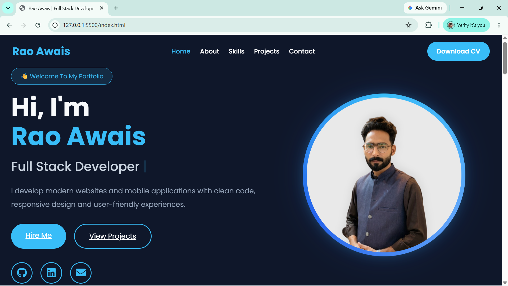
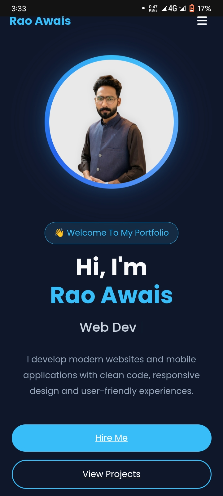

<div align="center">

# Rao Awais — Developer Portfolio

A modern, responsive and performance-focused portfolio website built to showcase projects, technical skills and professional experience through a clean, premium user interface.

<br>



<br><br>


</div>

---

# About

This portfolio was designed and developed from scratch with a strong emphasis on clean architecture, reusable components, scalability and modern UI principles.

Rather than serving as a simple personal website, it represents my development approach—writing maintainable code, building responsive layouts and creating polished user experiences that work consistently across devices.

Every page has been carefully structured with reusable systems, modular JavaScript rendering, and responsive layouts to keep the project organized and future-proof.

---

# Highlights

* Premium modern interface
* Fully responsive architecture
* Dynamic project rendering
* Dynamic skill rendering
* Modular JavaScript structure
* Reusable UI components
* Glassmorphism inspired interface
* Project Details pages
* Skill Details pages
* Responsive navigation
* Optimized typography
* Clean and maintainable codebase
* Component-based rendering approach
* Easy future scalability

---

# Technology Stack

* HTML5
* CSS3
* JavaScript (ES6)
* Bootstrap
* Font Awesome
* EmailJS

---

# Project Structure

```text
Portfolio/
│
├── css/
│   ├── style.css
│   └── responsiveness/
│       ├── desktop-fluid.css
│       ├── 1200.css
│       ├── 992.css
│       ├── 768.css
│       └── 576.css
│
├── js/
│   ├── script.js
│   ├── projects.js
│   ├── skills.js
│   ├── project-details.js
│   ├── skill-details.js
│   └── ...
│
├── images/
│   ├── github/
│   ├── logos/
|   ├── profile/
|
├── index.html
├── about.html
├── projects.html
├── project-details.html
├── skills.html
├── skill-details.html
├── contact.html
│
└── README.md
```

---

# Screenshots

## Desktop Experience


---

## Tablet Experience


---

## Mobile Experience



---

## Project Details


---

# Design Philosophy

The primary goal of this project was not only to build a portfolio but to create a polished digital product that reflects professional frontend development practices.

The interface focuses on:

* visual hierarchy
* clean spacing
* reusable components
* consistent typography
* responsive layouts
* smooth interactions
* scalable architecture

Every section was intentionally designed to balance aesthetics with usability.

---

## Live Demo

🚧 Deployment in Progress

---

# Repository Status

🟢 Actively Maintained

---

# License

© 2026 Rao Awais - All Rights Reserved

This repository is intended for portfolio showcase purposes only.

The source code, design, UI components, assets and project structure may not be copied, redistributed or reused without explicit permission.

---

# Author

**Rao Awais**

BS Computer Science Student

Flutter Developer • Full Stack Developer • Modren Web and Apps

---

<div align="center">

Made with ❤️ using HTML, CSS & JavaScript

</div>
